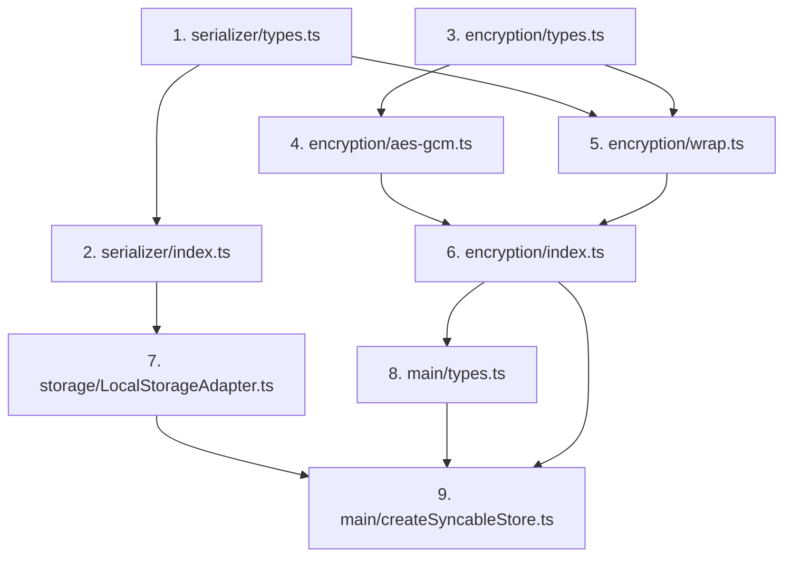

# Phase 3: Encryption Implementation

## TL;DR — Quick Reference for Implementers

### Core Concept
```
privateKey → EncryptionProvider → wrapWithEncryption(serializer) → storage factory
```

### New Files to Create
| File | Purpose |
|------|---------|
| `src/serializer/types.ts` | `Serializer<T>` interface, `createJsonSerializer()` |
| `src/serializer/index.ts` | Re-exports |
| `src/encryption/types.ts` | `EncryptionProvider`, `ENCRYPTED_PREFIX`, `isEncrypted()`, `EncryptedDataError` |
| `src/encryption/aes-gcm.ts` | Default AES-GCM implementation |
| `src/encryption/wrap.ts` | `wrapWithEncryption()` helper |
| `src/encryption/index.ts` | Re-exports |

### Existing Files to Modify
| File | Changes |
|------|---------|
| `src/storage/LocalStorageAdapter.ts` | Change signature from `(serialize, deserialize)` → `(serializer)` |
| `src/main/types.ts` | Add `encryptionFactory?: EncryptionProviderFactory` to config |
| `src/main/createSyncableStore.ts` | Create serializer with encryption, pass to storage factory |

### Key Pattern: Avoid Microtask Overhead
```typescript
// DON'T: Always schedules microtask even for sync functions
const result = await serializer.serialize(data);

// DO: Only await if actually a Promise
const resultOrPromise = serializer.serialize(data);
const result = resultOrPromise instanceof Promise ? await resultOrPromise : resultOrPromise;
```

---

## Current State (after Phase 1 & 2)

- `StorageAdapterFactory<T> = () => AsyncStorage<T>` — no `privateKey` param
- `WatchableStorageAdapterFactory<T> = () => WatchableStorage<T>` — same
- `createLocalStorageAdapter<T>` — standalone adapter, own listener
- `createLocalStorageAdapterFactory<T>` — shared listener across adapters, delegates to shared `createAdapter` internal
- Both share code via internal `createAdapter(serialize, deserialize, watcherState)`
- `SyncAdapterFactory<S> = (privateKey?) => SyncAdapter<S>` — still accepts `privateKey`
- `SyncableStoreConfig` still has `privateKey?: \`0x\${string}\``
- No encryption code exists — it was removed as placeholder

## Goal

Add real encryption to the storage layer. Each adapter created by a factory gets its own encryption key bound at creation time, while all adapters still share a single `storage` event listener.

## Design Principles

### 1. Encryption-Agnostic Storage Layer

The storage layer (LocalStorageAdapter, factories) remains completely encryption-agnostic. Encryption is handled via a `Serializer` object that wraps serialization logic, not inside the storage adapter.

This provides:
- **Cleaner separation of concerns**: Storage layer only knows about storing/retrieving strings
- **Simpler interfaces**: No `EncryptionProvider` parameter in storage factories
- **Reusable serializers**: Same `Serializer` can be passed to storage and sync adapters

### 2. Serializer as a Single Abstraction

Instead of passing `serialize` and `deserialize` as separate functions, bundle them into a `Serializer` interface:

```typescript
interface Serializer<T> {
  serialize: (data: T) => string | Promise<string>;
  deserialize: (data: string) => T | Promise<T | undefined>;
}
```

Benefits:
- **Single object to pass around** — one concern, one object
- **Reusable across adapters** — storage and sync use the same serializer
- **Extensible** — could add methods like `validate` later

### 3. Simple User API with Sensible Defaults

For the common case, users just provide `privateKey` and get AES-GCM encryption automatically:

```typescript
// Simple: just privateKey → uses default AES-GCM
const store = createSyncableStore({ privateKey: '0x...', ... });

// Advanced: custom encryption provider (rare)
const store = createSyncableStore({ 
  privateKey: '0x...', 
  encryptionFactory: myCustomProvider,
  ... 
});
```

## Design

### Serializer interface

```typescript
// packages/synqable/src/serializer/types.ts

/**
 * A Serializer handles conversion between typed data and strings.
 * Can optionally include encryption/decryption logic.
 */
export interface Serializer<T> {
  serialize: (data: T) => string | Promise<string>;
  deserialize: (data: string) => T | Promise<T | undefined>;
}

/**
 * Creates a basic JSON serializer without encryption.
 * Returns sync functions (not Promises) for optimal performance.
 */
export function createJsonSerializer<T>(): Serializer<T> {
  return {
    serialize: (data: T) => JSON.stringify(data),
    deserialize: (data: string) => JSON.parse(data) as T,
  };
}

/**
 * Type guard to check if a value is a Promise.
 * Used to avoid unnecessary microtask scheduling with sync functions.
 */
export function isPromise<T>(value: T | Promise<T>): value is Promise<T> {
  return value instanceof Promise;
}

// Usage pattern to avoid microtask overhead:
//   const resultOrPromise = serializer.serialize(data);
//   const result = isPromise(resultOrPromise) ? await resultOrPromise : resultOrPromise;
```

### EncryptionProvider interface

```typescript
// packages/synqable/src/encryption/types.ts

export interface EncryptionProvider {
  encrypt(data: string): Promise<string>;
  decrypt(encryptedData: string): Promise<string>;
}

export type EncryptionProviderFactory = (privateKey: `0x${string}`) => EncryptionProvider;

export const ENCRYPTED_PREFIX = 'enc:';

export function isEncrypted(data: string): boolean {
  return data.startsWith(ENCRYPTED_PREFIX);
}

export class EncryptedDataError extends Error {
  constructor(message = 'Cannot load encrypted data without encryption key') {
    super(message);
    this.name = 'EncryptedDataError';
  }
}
```

### AES-GCM default implementation

```typescript
// packages/synqable/src/encryption/aes-gcm.ts

export const createAesGcmProvider: EncryptionProviderFactory = (privateKey) => {
  let cryptoKey: CryptoKey | null = null;

  async function getKey(): Promise<CryptoKey> {
    if (cryptoKey) return cryptoKey;
    const keyBytes = hexToBytes(privateKey);
    const keyMaterial = await crypto.subtle.importKey('raw', keyBytes, 'HKDF', false, ['deriveKey']);
    cryptoKey = await crypto.subtle.deriveKey(
      { name: 'HKDF', hash: 'SHA-256', salt: new TextEncoder().encode('synqable-v1'), info: new TextEncoder().encode('aes-gcm-key') },
      keyMaterial,
      { name: 'AES-GCM', length: 256 },
      false,
      ['encrypt', 'decrypt'],
    );
    return cryptoKey;
  }

  return {
    async encrypt(data) {
      const key = await getKey();
      const iv = crypto.getRandomValues(new Uint8Array(12));
      const ciphertext = await crypto.subtle.encrypt({ name: 'AES-GCM', iv }, key, new TextEncoder().encode(data));
      const combined = new Uint8Array(iv.length + ciphertext.byteLength);
      combined.set(iv);
      combined.set(new Uint8Array(ciphertext), iv.length);
      return bytesToBase64(combined);
    },
    async decrypt(encryptedData) {
      const key = await getKey();
      const combined = base64ToBytes(encryptedData);
      const iv = combined.slice(0, 12);
      const ciphertext = combined.slice(12);
      const decrypted = await crypto.subtle.decrypt({ name: 'AES-GCM', iv }, key, ciphertext);
      return new TextDecoder().decode(decrypted);
    },
  };
};
```

### Wrapping a Serializer with encryption

```typescript
// packages/synqable/src/encryption/wrap.ts

import { Serializer } from '../serializer/types';
import { EncryptionProvider, ENCRYPTED_PREFIX, isEncrypted, EncryptedDataError } from './types';

/**
 * Wraps a Serializer with encryption logic.
 * - If encryption provided: saves with `enc:` prefix, decrypts on load
 * - If no encryption: saves plain, throws EncryptedDataError on encrypted data
 *
 * Note: When no encryption is provided, the returned serializer preserves
 * the sync/async nature of the base serializer to avoid microtask overhead.
 */
export function wrapWithEncryption<T>(
  baseSerializer: Serializer<T>,
  encryption?: EncryptionProvider,
): Serializer<T> {
  if (!encryption) {
    // No encryption: preserve sync behavior of base serializer
    return {
      serialize: baseSerializer.serialize,
      deserialize: (data: string) => {
        if (isEncrypted(data)) {
          throw new EncryptedDataError();
        }
        return baseSerializer.deserialize(data);
      },
    };
  }

  // With encryption: must be async
  return {
    serialize: async (data: T) => {
      // Check if base serializer is sync to avoid unnecessary microtask
      const resultOrPromise = baseSerializer.serialize(data);
      const serialized = resultOrPromise instanceof Promise
        ? await resultOrPromise
        : resultOrPromise;
      const encrypted = await encryption.encrypt(serialized);
      return ENCRYPTED_PREFIX + encrypted;
    },
    deserialize: async (data: string) => {
      if (isEncrypted(data)) {
        const decrypted = await encryption.decrypt(data.slice(ENCRYPTED_PREFIX.length));
        // Check if base deserializer is sync
        const resultOrPromise = baseSerializer.deserialize(decrypted);
        return resultOrPromise instanceof Promise
          ? await resultOrPromise
          : resultOrPromise;
      }
      // Plain data — readable (migration-friendly)
      const resultOrPromise = baseSerializer.deserialize(data);
      return resultOrPromise instanceof Promise
        ? await resultOrPromise
        : resultOrPromise;
    },
  };
}
```

### Storage layer uses Serializer

The storage adapter factory takes a `Serializer` object:

```typescript
// Storage types
export type WatchableStorageAdapterFactory<T> = () => WatchableStorage<T>;
export type StorageAdapterFactory<T> = () => AsyncStorage<T>;
```

#### How the factory pattern works

The `createLocalStorageAdapterFactory` function is a **factory creator** that captures a `Serializer` at creation time:

```typescript
// Public API - how users create a factory
export function createLocalStorageAdapterFactory<T>(
  serializer: Serializer<T>,
): WatchableStorageAdapterFactory<T> {
  // Shared watcher state across all adapters from this factory
  const watcherState: SharedWatcherState<T> = {
    watchers: new Map(),
    globalListener: null,
  };

  // Returns a factory function that creates adapters
  return () => createAdapter(serializer, watcherState);
}
```

The internal `createAdapter` uses the serializer, with optimized handling for sync serializers:

```typescript
function createAdapter<T>(
  serializer: Serializer<T>,
  watcherState: SharedWatcherState<T>,
): WatchableStorage<T> {
  return {
    async load(key) {
      const stored = localStorage.getItem(key);
      if (!stored) return undefined;
      // Check if deserialize is sync to avoid unnecessary microtask
      const resultOrPromise = serializer.deserialize(stored);
      return resultOrPromise instanceof Promise
        ? await resultOrPromise
        : resultOrPromise;
    },

    async save(key, data) {
      // Check if serialize is sync to avoid unnecessary microtask
      const resultOrPromise = serializer.serialize(data);
      const serialized = resultOrPromise instanceof Promise
        ? await resultOrPromise
        : resultOrPromise;
      localStorage.setItem(key, serialized);
    },

    // remove, exists unchanged
  };
}
```

**Optimization note**: For sync serializers (like `createJsonSerializer()`), the `instanceof Promise` check returns `false` and the code executes synchronously without scheduling a microtask. This ensures `localStorage.setItem` is called in the same call frame as `save()`.

### Simplified WatcherEntry

Each watcher entry stores the serializer's deserialize function:

```typescript
interface WatcherEntry<T> {
  callback: StorageChangeCallback<T>;
  deserialize: (data: string) => T | Promise<T | undefined>;
}

interface SharedWatcherState<T> {
  watchers: Map<string, Set<WatcherEntry<T>>>;
  globalListener: ((e: StorageEvent) => void) | null;
}
```

The global listener handles both sync and async deserializers:

```typescript
globalListener = (e: StorageEvent) => {
  if (!e.key) return;
  const entries = state.watchers.get(e.key);
  if (!entries || entries.size === 0) return;

  for (const { callback, deserialize } of entries) {
    if (e.newValue === null) {
      callback(e.key, undefined); // deletion
      continue;
    }

    try {
      const resultOrPromise = deserialize(e.newValue);
      if (resultOrPromise instanceof Promise) {
        // Async deserializer (encryption case)
        resultOrPromise
          .then((data) => {
            if (data !== undefined) {
              callback(e.key!, data);
            }
          })
          .catch(() => {
            callback(e.key!, undefined);
          });
      } else {
        // Sync deserializer (no encryption case)
        if (resultOrPromise !== undefined) {
          callback(e.key, resultOrPromise);
        }
      }
    } catch {
      callback(e.key, undefined);
    }
  }
};
```

**Note**: The global listener is no longer `async` — for sync serializers, callbacks fire immediately without microtask delay. For async serializers (encrypted), callbacks fire after decryption completes.

### Usage in createSyncableStore

```typescript
// createSyncableStore.ts

import { createAesGcmProvider } from '../encryption/aes-gcm';
import { wrapWithEncryption } from '../encryption/wrap';
import { createJsonSerializer, Serializer } from '../serializer/types';

// Default encryption factory
const DEFAULT_ENCRYPTION_FACTORY = createAesGcmProvider;

// In createSyncableStore
const encryption = config.privateKey
  ? (config.encryptionFactory ?? DEFAULT_ENCRYPTION_FACTORY)(config.privateKey)
  : undefined;

// Create serializer with optional encryption
const serializer = wrapWithEncryption(
  createJsonSerializer<StoredState>(),
  encryption,
);

// Pass serializer to storage factory
const storageAdapterFactory = createLocalStorageAdapterFactory(serializer);
const storageAdapter = storageAdapterFactory();

// Same serializer could be used for sync adapter (future)
// const syncAdapter = createSyncAdapter(serializer);
```

Or in the multi-account factory with `AccountOrSigner`:

```typescript
// Account → no encryption
// Signer  → encryptionFactory(signer.privateKey)
const encryptionFactory = config.encryptionFactory ?? DEFAULT_ENCRYPTION_FACTORY;
const encryption = accountOrSigner.type === 'signer'
  ? encryptionFactory(accountOrSigner.privateKey)
  : undefined;

// Create serializer for this account
const serializer = wrapWithEncryption(
  createJsonSerializer<StoredState>(),
  encryption,
);

// For multi-account: each account gets its own factory with its own serializer
const factory = createLocalStorageAdapterFactory(serializer);
const adapter = factory();
```

### SyncableStoreConfig changes

```typescript
export interface SyncableStoreConfig<S extends Schema> {
  // existing fields...
  privateKey?: `0x${string}`;
  /** 
   * Custom factory to create EncryptionProvider from privateKey.
   * Defaults to AES-GCM encryption if not provided.
   */
  encryptionFactory?: EncryptionProviderFactory;
}
```

## Behavior rules

1. **No encryption (no privateKey):**
   - Save: plain serialized data
   - Load plain data: works
   - Load encrypted data (`enc:` prefix): throws `EncryptedDataError`

2. **With encryption (privateKey provided):**
   - Save: `enc:` + encrypted serialized data
   - Load encrypted data: decrypt then deserialize
   - Load plain data: deserialize directly (migration-friendly)

3. **Watch across encryption boundaries:**
   - Each watcher has its own deserialize function (which may or may not include decryption)
   - If a watcher can't decrypt, its deserialize returns `undefined` → event skipped
   - Deletions (`newValue === null`) are always forwarded

## File structure

```
packages/synqable/src/
├── serializer/
│   ├── index.ts          # re-exports
│   └── types.ts          # Serializer interface, createJsonSerializer
├── encryption/
│   ├── index.ts          # re-exports
│   ├── types.ts          # EncryptionProvider, EncryptedDataError, ENCRYPTED_PREFIX, isEncrypted
│   ├── aes-gcm.ts        # createAesGcmProvider (default implementation)
│   └── wrap.ts           # wrapWithEncryption helper
├── storage/
│   ├── types.ts          # StorageAdapterFactory (unchanged signatures)
│   ├── LocalStorageAdapter.ts  # createLocalStorageAdapterFactory(serializer), createAdapter
│   └── index.ts
└── main/
    ├── types.ts          # add optional encryptionFactory to SyncableStoreConfig
    └── createSyncableStore.ts  # bind privateKey → encryption → serializer
```

## User API Summary

### Simple case (most users)

```typescript
const store = createSyncableStore({
  schema: mySchema,
  privateKey: '0x1234...', // Just provide this, AES-GCM encryption is automatic
  // ... other config
});
```

### Custom encryption (advanced)

```typescript
const store = createSyncableStore({
  schema: mySchema,
  privateKey: '0x1234...',
  encryptionFactory: myCustomProvider, // Override default AES-GCM
  // ... other config
});
```

### No encryption (public data)

```typescript
const store = createSyncableStore({
  schema: mySchema,
  // No privateKey = no encryption
  // ... other config
});
```

## Implementation tasks

1. [ ] Create `serializer/types.ts` — `Serializer` interface, `createJsonSerializer`
2. [ ] Create `serializer/index.ts` — re-exports
3. [ ] Create `encryption/types.ts` — `EncryptionProvider`, `EncryptionProviderFactory`, `ENCRYPTED_PREFIX`, `isEncrypted`, `EncryptedDataError`
4. [ ] Create `encryption/aes-gcm.ts` — `createAesGcmProvider` with WebCrypto
5. [ ] Create `encryption/wrap.ts` — `wrapWithEncryption(serializer, encryption?)` returns wrapped `Serializer`
6. [ ] Create `encryption/index.ts` — re-exports
7. [ ] Update `createLocalStorageAdapterFactory` to take `Serializer<T>` instead of separate functions
8. [ ] Update `createAdapter` to use `serializer.serialize`/`serializer.deserialize`
9. [ ] Update `WatcherEntry` to store `deserialize` from the serializer
10. [ ] Update global listener to call async deserialize and handle `undefined` return
11. [ ] Add optional `encryptionFactory` to `SyncableStoreConfig`
12. [ ] Update `createSyncableStore` to:
    - Default `encryptionFactory` to `createAesGcmProvider` when `privateKey` is set
    - Create serializer with `wrapWithEncryption`
    - Pass serializer to factory creator
13. [ ] Update exports in `index.ts` files
14. [ ] Write tests for `Serializer` (json round-trip)
15. [ ] Write tests for `EncryptionProvider` (aes-gcm round-trip)
16. [ ] Write tests for `wrapWithEncryption` helper
17. [ ] Write tests for encrypted storage (save/load/watch with encrypted serializer)
18. [ ] Write tests for mixed mode (encrypted serializer reading plain data, plain serializer rejecting encrypted data)
19. [ ] Run full test suite

## Open questions

- **Should `createLocalStorageAdapter` (standalone, non-factory) also take a Serializer?** Yes, for consistency. Change signature from separate functions to `Serializer<T>`.
- **Sync adapter encryption**: Currently `SyncAdapterFactory` takes `privateKey` directly. It could take a `Serializer` instead, making encryption handling consistent across storage and sync. This would allow reusing the same serializer for both adapters.

---

## Implementation Order (Dependency Graph)



**Recommended order:**
1. `serializer/types.ts` — no dependencies, foundation
2. `serializer/index.ts` — just re-exports
3. `encryption/types.ts` — no dependencies
4. `encryption/aes-gcm.ts` — depends on encryption/types
5. `encryption/wrap.ts` — depends on serializer + encryption/types
6. `encryption/index.ts` — just re-exports
7. `storage/LocalStorageAdapter.ts` — update to use Serializer
8. `main/types.ts` — add encryptionFactory to config
9. `main/createSyncableStore.ts` — wire everything together

---

## Example Test Cases

### 1. Serializer round-trip
```typescript
test('createJsonSerializer round-trips data', () => {
  const serializer = createJsonSerializer<{ name: string }>();
  const data = { name: 'test' };
  const serialized = serializer.serialize(data);
  const deserialized = serializer.deserialize(serialized);
  expect(deserialized).toEqual(data);
});
```

### 2. Encryption provider round-trip
```typescript
test('createAesGcmProvider encrypts and decrypts', async () => {
  const provider = createAesGcmProvider('0x1234567890abcdef1234567890abcdef1234567890abcdef1234567890abcdef');
  const plaintext = 'hello world';
  const encrypted = await provider.encrypt(plaintext);
  const decrypted = await provider.decrypt(encrypted);
  expect(decrypted).toBe(plaintext);
  expect(encrypted).not.toBe(plaintext); // sanity check
});
```

### 3. wrapWithEncryption with encryption
```typescript
test('wrapWithEncryption adds prefix and encrypts', async () => {
  const provider = createAesGcmProvider('0x...');
  const serializer = wrapWithEncryption(createJsonSerializer(), provider);
  
  const data = { value: 42 };
  const serialized = await serializer.serialize(data);
  
  expect(serialized.startsWith('enc:')).toBe(true);
  
  const deserialized = await serializer.deserialize(serialized);
  expect(deserialized).toEqual(data);
});
```

### 4. wrapWithEncryption without encryption rejects encrypted data
```typescript
test('wrapWithEncryption without encryption throws on encrypted data', () => {
  const serializer = wrapWithEncryption(createJsonSerializer());
  
  expect(() => serializer.deserialize('enc:...')).toThrow(EncryptedDataError);
});
```

### 5. Migration: encrypted serializer reads plain data
```typescript
test('encrypted serializer can read plain data', async () => {
  const provider = createAesGcmProvider('0x...');
  const serializer = wrapWithEncryption(createJsonSerializer(), provider);
  
  // Plain JSON (not encrypted)
  const plainData = JSON.stringify({ migrated: true });
  const deserialized = await serializer.deserialize(plainData);
  
  expect(deserialized).toEqual({ migrated: true });
});
```

### 6. Storage adapter with sync serializer (no microtask)
```typescript
test('save with sync serializer is synchronous', () => {
  const serializer = createJsonSerializer();
  const adapter = createLocalStorageAdapterFactory(serializer)();
  
  // Should not schedule microtask for sync serializer
  let callOrder: string[] = [];
  adapter.save('key', { value: 1 }).then(() => callOrder.push('save resolved'));
  callOrder.push('after save call');
  
  // For sync serializer, localStorage.setItem should happen before microtask
  expect(localStorage.getItem('key')).toBe('{"value":1}');
});
```

---

## Common Pitfalls & Notes

### 1. hexToBytes / bytesToBase64 utilities
The `aes-gcm.ts` implementation uses `hexToBytes()` and `bytesToBase64()` — you'll need to implement these or import from a utility library:

```typescript
function hexToBytes(hex: `0x${string}`): Uint8Array {
  const hexString = hex.slice(2);
  const bytes = new Uint8Array(hexString.length / 2);
  for (let i = 0; i < bytes.length; i++) {
    bytes[i] = parseInt(hexString.slice(i * 2, i * 2 + 2), 16);
  }
  return bytes;
}

function bytesToBase64(bytes: Uint8Array): string {
  return btoa(String.fromCharCode(...bytes));
}

function base64ToBytes(base64: string): Uint8Array {
  return Uint8Array.from(atob(base64), c => c.charCodeAt(0));
}
```

### 2. Private key length
AES-256 requires a 32-byte (256-bit) key. The private key hex string should be 64 characters (plus `0x` prefix = 66 total). Validate this or derive a key using HKDF (which the implementation does).

### 3. WebCrypto availability
`crypto.subtle` is available in:
- Modern browsers (all major ones)
- Node.js 15+ (global `crypto.subtle`)
- Older Node.js via `require('crypto').webcrypto.subtle`

You may need a polyfill or conditional import for older environments.

### 4. Error handling in globalListener
The global listener catches errors but should NOT throw — it's an event handler. Errors are handled by calling `callback(key, undefined)`.

### 5. Type narrowing with isPromise
Use `instanceof Promise` rather than checking for `.then` method — it's more reliable and works with TypeScript's type narrowing.

### 6. The `!` assertion in globalListener
Note `e.key!` in the Promise handler — this is safe because we already checked `!e.key` at the top of the function, but TypeScript doesn't track this across the async boundary. The non-null assertion is intentional.

---

## Reference: Current LocalStorageAdapter Signature

Current signature in `packages/synqable/src/storage/LocalStorageAdapter.ts`:

```typescript
// Current (to be changed)
export function createLocalStorageAdapterFactory<T>(
  serialize: (data: T) => string,
  deserialize: (data: string) => T,
): WatchableStorageAdapterFactory<T>

// New (after this implementation)
export function createLocalStorageAdapterFactory<T>(
  serializer: Serializer<T>,
): WatchableStorageAdapterFactory<T>
```

The internal `createAdapter` function also changes similarly.
