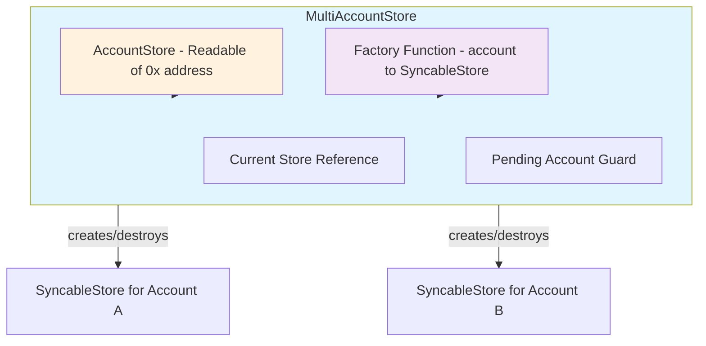
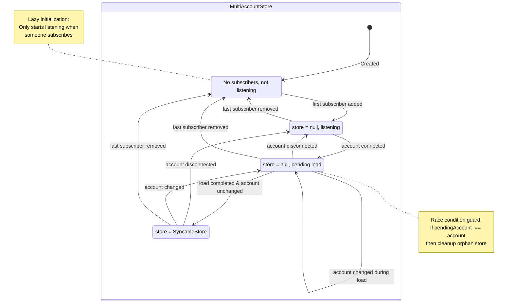

# Multi-Account Data Manager

## Implementation Context

### Existing Codebase Structure

The synqable package is located at `packages/synqable/src/` with the following structure:

```
packages/synqable/src/
├── main/
│   ├── createSyncableStore.ts  # Single-account store implementation
│   ├── types.ts                # Core types: Schema, SyncableStore, AsyncState, etc.
│   ├── helpers.ts              # Utility functions
│   ├── merge.ts                # CRDT merge logic
│   ├── cleanup.ts              # Tombstone/expired item cleanup
│   └── index.ts                # Re-exports
├── factory/
│   ├── index.ts                # createSyncableStoreFactory function
│   └── types.ts                # SyncableStoreFactoryConfig
├── storage/
│   ├── types.ts                # AsyncStorage, StorageConfig interfaces
│   ├── LocalStorageAdapter.ts  # Browser localStorage adapter
│   └── index.ts                # Re-exports
├── sync/
│   ├── types.ts                # SyncAdapter, SyncConfig, SyncStatus
│   └── index.ts                # Re-exports
├── multi-account/
│   └── index.ts                # Empty - TO BE IMPLEMENTED
└── index.ts                    # Main entry point
```

### Key Existing Types to Reference

From `packages/synqable/src/main/types.ts`:
- `Schema` - Field type definitions
- `SyncableStore<S>` - Single-account store interface with `load()`, `stop()`, `subscribe()`
- `AsyncState<T>` - Union: `idle` | `loading` | `ready` with account and data
- `Readable<T>` - Svelte store contract `{ subscribe(cb): () => void }`

From `packages/synqable/src/factory/index.ts`:
- `createSyncableStoreFactory<S>()` - Returns `(account) => SyncableStore<S>`

### Important Implementation Notes

1. **The `Readable<T>` type** is already defined in `main/types.ts` - reuse it for `AccountStore`

2. **The factory function signature** from `createSyncableStoreFactory` is:
   ```typescript
   (account: `0x${string}`) => SyncableStore<S>
   ```

3. **SyncableStore lifecycle**:
   - Call `load()` to initialize (async)
   - Call `stop()` to cleanup resources
   - `state.status` transitions: `idle` → `loading` → `ready`

4. **Re-export pattern**: Update `packages/synqable/src/index.ts` to include:
   ```typescript
   export * from './multi-account/index.js';
   ```

## Goal

Design a higher-level manager that handles multi-account switching on top of the single-account `SyncableStore`. This separates concerns:

- **SyncableStore**: Single-account data management (no account switching logic)
- **SyncableStoreFactory**: Creates store instances for specific accounts
- **MultiAccountStore**: Multi-account lifecycle management, exposes the "current" store

## Architecture Overview



## Current Implementation Overview

### Existing Components

1. **[`SyncableStore`](../packages/synqable/src/main/types.ts:319)** - Single-account store with:
   - Static `account: \`0x${string}\`` binding
   - Explicit [`load()`](../packages/synqable/src/main/createSyncableStore.ts:449) lifecycle
   - [`stop()`](../packages/synqable/src/main/createSyncableStore.ts:705) for cleanup
   - Svelte-compatible [`subscribe()`](../packages/synqable/src/main/createSyncableStore.ts:692)

2. **[`createSyncableStoreFactory()`](../packages/synqable/src/factory/index.ts:5)** - Factory that:
   - Takes [`SyncableStoreFactoryConfig`](../packages/synqable/src/factory/types.ts:19) with key generator
   - Returns `(account: \`0x${string}\`) => SyncableStore<S>`

## Key Design Decisions

### 1. Factory Function as Parameter

The multi-account manager accepts a factory function rather than configuration. This provides maximum flexibility:

```typescript
// Option 1: Use the built-in factory helper
const factory = createSyncableStoreFactory({
  schema: mySchema,
  storage: { adapter, key: (account) => `data-${account}` },
  defaultData: () => ({ operations: {} }),
});

const multiStore = createMultiAccountStore({
  accountStore,
  factory,
});

// Option 2: Custom factory with additional logic
const customFactory = (account: `0x${string}`) => {
  console.log(`Creating store for ${account}`);
  return createSyncableStore({
    schema: mySchema,
    account,
    storage: { adapter, key: `custom-${account}` },
    defaultData: () => ({ operations: {} }),
  });
};

const multiStore = createMultiAccountStore({
  accountStore,
  factory: customFactory,
});
```

### 2. Store Reference as Feature, Not Bug

When `.get()` returns a store reference, it captures that specific accounts store. This is intentional:

```typescript
// User is on Account A
const accountDataA = multiAccountStore.get();

// Start async operation
const result = await someAsyncWork();

// User switched to Account B during the async work
// accountDataA is STILL Account A store - CORRECT!
accountDataA.set('result', result); // Writes to Account A, not B
```

This "actor model" pattern ensures operations complete on the intended target, preventing silent data corruption.

### 3. Race Condition Handling at Manager Level

The single-account store does not handle race conditions. The manager handles this with a `pendingAccount` guard:

```typescript
let pendingAccount: `0x${string}` | undefined;

accountStore.subscribe(async (account) => {
  pendingAccount = account;
  
  currentStore?.stop();
  currentStore = null;
  notify(); // Immediately notify that store is changing
  
  if (account) {
    const store = factory(account);
    await store.load();
    
    // Guard: only set if still the intended account
    if (pendingAccount === account) {
      currentStore = store;
      notify();
    } else {
      // Account changed during load - cleanup orphan store
      store.stop();
    }
  }
});
```

### 4. Null/Undefined States During Transition

Components must handle transitional states:

```svelte
<script lang="ts">
  import { multiAccountStore } from '$lib/context';
  
  // The store value can be null during transition
  let currentStore = $multiAccountStore;
  let operations = $derived(currentStore?.watchField('operations'));
</script>

{#if currentStore?.state.status === 'ready' && operations}
  {#each Object.entries($operations ?? {}) as [id, op]}
    <OperationCard operation={op} />
  {/each}
{:else if currentStore?.state.status === 'loading'}
  <LoadingSpinner />
{:else}
  <ConnectPrompt />
{/if}
```

## Interface Design

### Types

```typescript
import type { Schema, SyncableStore, Readable } from './main/types.js';

/**
 * Account store - a readable store of Ethereum addresses.
 * Value is undefined when no account is connected.
 */
export type AccountStore = Readable<`0x${string}` | undefined>;

/**
 * Factory function that creates a SyncableStore for a given account.
 */
export type SyncableStoreFactory<S extends Schema> = (
  account: `0x${string}`
) => SyncableStore<S>;

/**
 * Configuration for creating a multi-account store manager.
 */
export interface MultiAccountStoreConfig<S extends Schema> {
  /** Account store to subscribe to */
  accountStore: AccountStore;
  
  /** Factory function to create stores for accounts */
  factory: SyncableStoreFactory<S>;
}

/**
 * Multi-account store manager that wraps single-account SyncableStores.
 *
 * Follows Svelte store contract with lazy initialization:
 * - First subscriber triggers account store subscription
 * - Last subscriber leaving triggers cleanup
 */
export interface MultiAccountStore<S extends Schema> {
  /**
   * Svelte store contract - subscribe to current store changes.
   * Value is null when no account connected or during transition.
   *
   * Lifecycle:
   * - First subscriber: starts listening to account changes
   * - Last subscriber leaves: stops listening, cleans up current store
   */
  subscribe(
    callback: (store: SyncableStore<S> | null) => void
  ): () => void;
  
  /**
   * Synchronous access to current store.
   * Returns null when no account connected or no subscribers.
   *
   * IMPORTANT: Captured reference remains valid even after account switch.
   * This is intentional for async operation safety.
   */
  get(): SyncableStore<S> | null;
  
  /**
   * Get the current account address - if any.
   */
  readonly currentAccount: `0x${string}` | undefined;
}
```

## Implementation

```typescript
import type { Schema, SyncableStore, Readable } from './main/types.js';

export type AccountStore = Readable<`0x${string}` | undefined>;

export type SyncableStoreFactory<S extends Schema> = (
  account: `0x${string}`
) => SyncableStore<S>;

export interface MultiAccountStoreConfig<S extends Schema> {
  accountStore: AccountStore;
  factory: SyncableStoreFactory<S>;
}

export interface MultiAccountStore<S extends Schema> {
  subscribe(callback: (store: SyncableStore<S> | null) => void): () => void;
  get(): SyncableStore<S> | null;
  readonly currentAccount: `0x${string}` | undefined;
}

export function createMultiAccountStore<S extends Schema>(
  config: MultiAccountStoreConfig<S>
): MultiAccountStore<S> {
  const { accountStore, factory } = config;
  
  // State
  let currentStore: SyncableStore<S> | null = null;
  let currentAccount: `0x${string}` | undefined;
  let pendingAccount: `0x${string}` | undefined;
  let unsubscribeAccount: (() => void) | undefined;
  
  // Subscribers
  const subscribers = new Set<(store: SyncableStore<S> | null) => void>();
  
  function notify(): void {
    for (const callback of subscribers) {
      callback(currentStore);
    }
  }
  
  async function handleAccountChange(account: `0x${string}` | undefined): Promise<void> {
    // Track which account we are switching to
    pendingAccount = account;
    currentAccount = account;
    
    // Stop and cleanup previous store
    if (currentStore) {
      currentStore.stop();
      currentStore = null;
      notify(); // Notify immediately that store is null/transitioning
    }
    
    // No account - stay null
    if (!account) {
      return;
    }
    
    // Create new store for this account
    const store = factory(account);
    
    try {
      // Load the store - async
      await store.load();
      
      // Race condition guard: only set if still the intended account
      if (pendingAccount === account) {
        currentStore = store;
        notify();
      } else {
        // Account changed during load - cleanup orphan store
        store.stop();
      }
    } catch (error) {
      // Load failed - cleanup
      store.stop();
      
      // Only log if still the intended account
      if (pendingAccount === account) {
        console.error('Failed to load account data:', error);
        // The store remains null - components will see the disconnect state
      }
    }
  }
  
  function start(): void {
    if (unsubscribeAccount) {
      return; // Already started
    }
    unsubscribeAccount = accountStore.subscribe(handleAccountChange);
  }
  
  function stop(): void {
    unsubscribeAccount?.();
    unsubscribeAccount = undefined;
    currentStore?.stop();
    currentStore = null;
    currentAccount = undefined;
    pendingAccount = undefined;
  }
  
  return {
    subscribe(callback: (store: SyncableStore<S> | null) => void): () => void {
      // First subscriber - start listening to account changes
      if (subscribers.size === 0) {
        start();
      }
      
      subscribers.add(callback);
      callback(currentStore); // Svelte store contract: call immediately
      
      // Return unsubscribe function
      return () => {
        subscribers.delete(callback);
        
        // Last subscriber left - stop and cleanup
        if (subscribers.size === 0) {
          stop();
        }
      };
    },
    
    get(): SyncableStore<S> | null {
      return currentStore;
    },
    
    get currentAccount(): `0x${string}` | undefined {
      return currentAccount;
    },
  };
}
```

## Usage Examples

### Basic Usage with Factory Helper

```typescript
import { 
  createMultiAccountStore, 
  createSyncableStoreFactory,
  defineSchema,
  permanent,
  map
} from 'synqable';

// Define schema
const schema = defineSchema({
  settings: permanent<{ theme: string }>(),
  operations: map<{ hash: string; status: string }>(),
});

// Create factory
const factory = createSyncableStoreFactory({
  schema,
  storage: {
    adapter: localStorage,
    key: (account) => `myapp-${account}`,
  },
  defaultData: () => ({
    settings: { theme: 'dark' },
    operations: {},
  }),
});

// Create multi-account store
const multiAccountStore = createMultiAccountStore({
  accountStore, // From your wallet connection library
  factory,
});

// Auto-starts when first subscriber subscribes
// Auto-stops when last subscriber unsubscribes
```

### In Svelte Components

```svelte
<script lang="ts">
  import { multiAccountStore } from '$lib/context';
  
  // Get the current store - reactive
  let accountStore = $multiAccountStore;
  
  // Derived field stores - re-evaluate when accountStore changes
  let operations = $derived(accountStore?.watchField('operations'));
</script>

{#if accountStore?.state.status === 'ready'}
  {#if operations}
    {#each Object.entries($operations ?? {}) as [id, op]}
      <OperationCard operation={op} />
    {/each}
  {/if}
{:else if accountStore?.state.status === 'loading'}
  <p>Loading account data...</p>
{:else}
  <p>Connect your wallet to continue</p>
{/if}
```

### Imperative Usage - Actions, Event Handlers

```typescript
// In an action or event handler
async function submitTransaction() {
  // Capture reference at start of operation
  const store = multiAccountStore.get();
  if (!store || store.state.status !== 'ready') {
    throw new Error('No account connected');
  }
  
  // Start async work
  const result = await sendTransaction(...);
  
  // Safe to use captured reference - writes to correct account
  // even if user switched accounts during transaction
  store.add('operations', result.id, {
    hash: result.hash,
    status: 'pending',
  }, { deleteAt: Date.now() + 7 * 24 * 60 * 60 * 1000 });
}
```

### Custom Factory with Additional Logic

```typescript
// Factory with logging, metrics, or custom initialization
const customFactory = (account: `0x${string}`) => {
  console.log(`[MultiAccount] Creating store for ${account}`);
  
  const store = createSyncableStore({
    schema,
    account,
    storage: {
      adapter: myAdapter,
      key: `data-${account}`,
    },
    defaultData: () => ({ settings: {}, operations: {} }),
    sync: {
      adapter: createSyncAdapter({ endpoint: '/api/sync' }),
    },
  });
  
  // Could add additional setup here
  return store;
};

const multiAccountStore = createMultiAccountStore({
  accountStore,
  factory: customFactory,
});
// Auto-starts/stops based on subscribers
```

## State Diagram



## File Structure

```
packages/synqable/src/
├── multi-account/
│   ├── index.ts        # createMultiAccountStore + exports
│   └── types.ts        # MultiAccountStore, AccountStore types
├── factory/
│   ├── index.ts        # createSyncableStoreFactory
│   └── types.ts        # SyncableStoreFactoryConfig
├── main/
│   └── ...             # SyncableStore (unchanged)
└── index.ts            # Re-export multi-account module
```

## Benefits

1. **Separation of Concerns**
   - SyncableStore: Pure single-account data management
   - Factory: Store creation configuration
   - MultiAccountStore: Account lifecycle orchestration

2. **Maximum Flexibility**
   - Factory function parameter allows any store creation logic
   - Can use built-in factory helper or custom implementation
   - Easy to add logging, metrics, or custom initialization

3. **Actor Model Safety**
   - Captured store references remain valid
   - Async operations write to intended account
   - No silent data corruption

4. **Clear State Transitions**
   - `null` → Store is transitioning or no account
   - `loading` → Store is loading data
   - `ready` → Safe to read/write

5. **Testability**
   - SyncableStore can be tested in isolation with static account
   - MultiAccountStore can be tested with mock AccountStore
   - Factory function can be mocked for unit tests

## Implementation Checklist

- [ ] Create `packages/synqable/src/multi-account/types.ts`
  - [ ] Define `AccountStore` type alias
  - [ ] Define `SyncableStoreFactory<S>` type alias
  - [ ] Define `MultiAccountStoreConfig<S>` interface
  - [ ] Define `MultiAccountStore<S>` interface

- [ ] Create `packages/synqable/src/multi-account/index.ts`
  - [ ] Implement `createMultiAccountStore()` function
  - [ ] Export all types and functions

- [ ] Update `packages/synqable/src/index.ts`
  - [ ] Re-export multi-account module

- [ ] Add tests
  - [ ] Test lazy start on first subscriber
  - [ ] Test cleanup on last subscriber leaving
  - [ ] Test basic account switching
  - [ ] Test race condition handling - account changes during load
  - [ ] Test store reference capture safety
  - [ ] Test null state during transition
  - [ ] Test re-subscribe after all subscribers left

- [ ] Update documentation
  - [ ] Add multi-account usage examples
  - [ ] Document the actor model pattern for async operations

## Edge Cases to Handle

### 1. Subscriber Added During Account Load

When a new subscriber is added while the store is loading for a new account:
- They should receive `null` immediately (current state)
- They will get notified when load completes

### 2. All Subscribers Leave During Load

If all subscribers unsubscribe while a store load is in progress:
- The load continues but the orphan store is stopped when load completes
- Use `pendingAccount` guard: if `undefined` after load, do not set currentStore
- Add check: `if (subscribers.size === 0) { store.stop(); return; }`

### 3. Account Changes Rapidly

User rapidly switches A → B → C:
- Each switch sets `pendingAccount` to the new value
- Orphan stores from A and B are stopped when their loads complete
- Only C's store becomes current

### 4. Account Store Emits Same Account

If account store emits the same address twice:
- Should be a no-op (do not recreate the store)
- Add check: `if (account === currentAccount && currentStore) return`

### 5. Factory Throws

If the factory function throws when creating a store:
- Catch the error
- Log it
- Leave currentStore as null
- Do not crash

## Implementation Snippet for Type Imports

```typescript
// packages/synqable/src/multi-account/types.ts
import type { Schema, SyncableStore, Readable } from '../main/types.js';

// AccountStore is just a Readable of address or undefined
export type AccountStore = Readable<`0x${string}` | undefined>;

// Factory function type
export type SyncableStoreFactory<S extends Schema> = (
  account: `0x${string}`
) => SyncableStore<S>;

export interface MultiAccountStoreConfig<S extends Schema> {
  accountStore: AccountStore;
  factory: SyncableStoreFactory<S>;
}

export interface MultiAccountStore<S extends Schema> {
  subscribe(callback: (store: SyncableStore<S> | null) => void): () => void;
  get(): SyncableStore<S> | null;
  readonly currentAccount: `0x${string}` | undefined;
}
```

## Test Helper Example

```typescript
// Mock account store for testing
function createMockAccountStore(): {
  store: AccountStore;
  setAccount: (account: `0x${string}` | undefined) => void;
} {
  let currentAccount: `0x${string}` | undefined;
  const subscribers = new Set<(account: `0x${string}` | undefined) => void>();
  
  return {
    store: {
      subscribe(callback) {
        subscribers.add(callback);
        callback(currentAccount);
        return () => subscribers.delete(callback);
      },
    },
    setAccount(account) {
      currentAccount = account;
      for (const cb of subscribers) {
        cb(account);
      }
    },
  };
}

// Mock factory for testing
function createMockFactory<S extends Schema>(
  schema: S,
  defaultData: () => DataOf<S>
): {
  factory: SyncableStoreFactory<S>;
  getCreatedStores: () => Map<string, SyncableStore<S>>;
  getStoppedStores: () => Set<string>;
} {
  const stores = new Map<string, SyncableStore<S>>();
  const stoppedStores = new Set<string>();
  
  return {
    factory: (account) => {
      const store = createSyncableStore({
        schema,
        account,
        storage: {
          adapter: createInMemoryStorageAdapter(),
          key: `test-${account}`
        },
        defaultData,
      });
      
      // Wrap stop to track calls
      const originalStop = store.stop.bind(store);
      store.stop = () => {
        stoppedStores.add(account);
        originalStop();
      };
      
      stores.set(account, store);
      return store;
    },
    getCreatedStores: () => stores,
    getStoppedStores: () => stoppedStores,
  };
}
```

## Quick Reference: File Changes Needed

1. **Create** `packages/synqable/src/multi-account/types.ts`
2. **Create** `packages/synqable/src/multi-account/index.ts` with `createMultiAccountStore()`
3. **Update** `packages/synqable/src/index.ts` to add: `export * from './multi-account/index.js';`
4. **Create** test file `packages/synqable/test/multi-account.test.ts`
